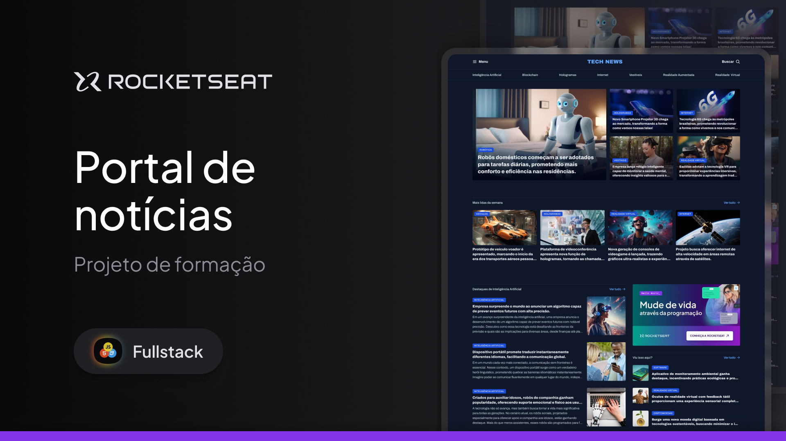

# PORTAL DE NOTÍCIAS



Este é um projeto de estudo simples, focado na criação da página inicial (homepage) de um portal de notícias com temática de tecnologia. O desenvolvimento foi realizado sem o uso de frameworks ou bibliotecas, utilizando estritamente HTML5 e CSS3 puros.

## 1. Objetivo do Projeto

O objetivo principal deste projeto é consolidar conhecimentos básicos e fundamentais de desenvolvimento web front-end:

Estrutura Semântica (HTML): Praticar o uso correto das tags HTML5 para criar uma estrutura de página lógica e acessível.

Estilização e Layout (CSS): Aplicar CSS puro para estilização (cores, tipografia, espaçamento) e, principalmente, para a criação de um layout complexo de portal de notícias (colunas, destaques, barras laterais) focado em desktop.

Fundamentos: Reforçar a base antes de migrar para projetos mais complexos que envolvam JavaScript ou frameworks.

## 2. Tecnologias Utilizadas

| Tecnologia | Versão/Tipo | Descrição                                                          |
| ---------- | ----------- | ------------------------------------------------------------------ |
| HTML       | HTML5       | Estrutura e conteúdo da página.                                    |
| CSS        | CSS3        | "Estilização, layout (Grid) e responsividade básica para desktop." |

## 3. Estrutura de Arquivos

A estrutura do projeto é a seguinte:

```bash
portal-de-noticias/
├── index.html          # O corpo principal do site (homepage)
├── css/
│   ├── index.css       # Todas as regras de estilo CSS
│   └── global.css
└── assets/
    ├── imagens/        # Imagens utilizadas nas notícias e ícones
    └── (outros)
```

## Screenshots
